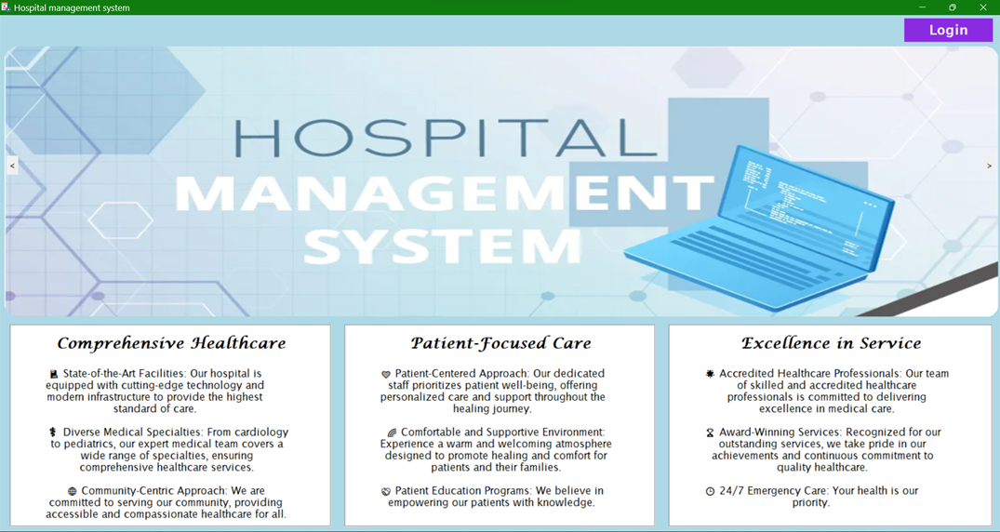
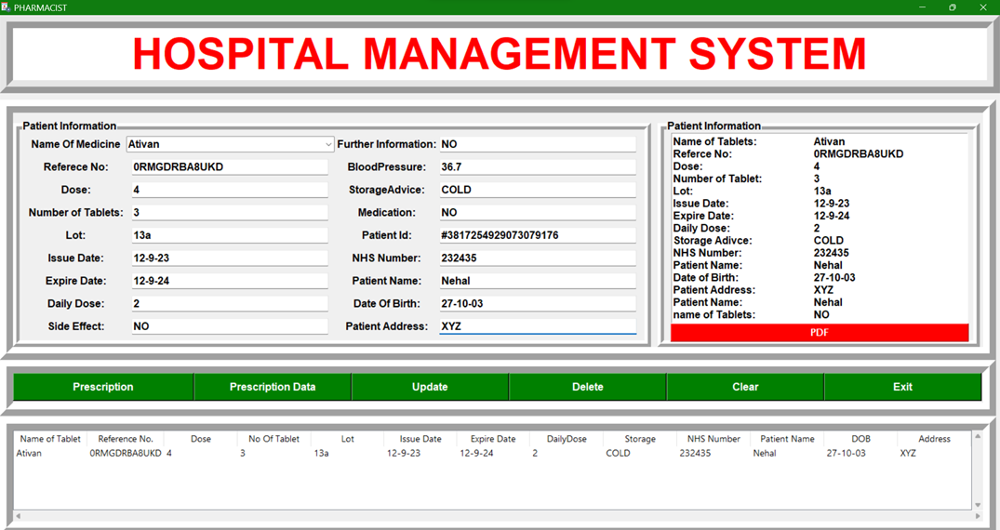
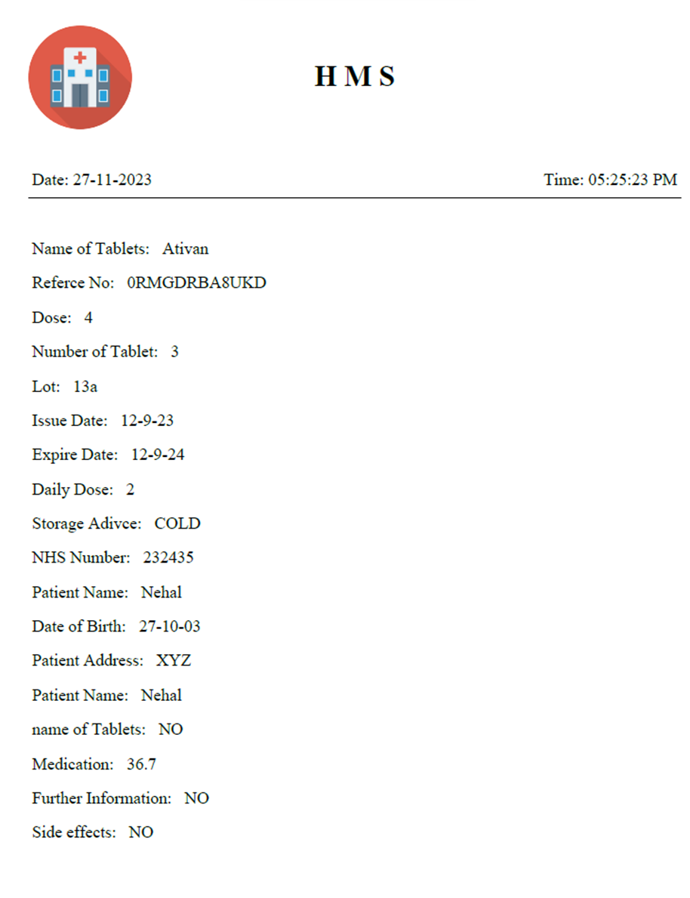
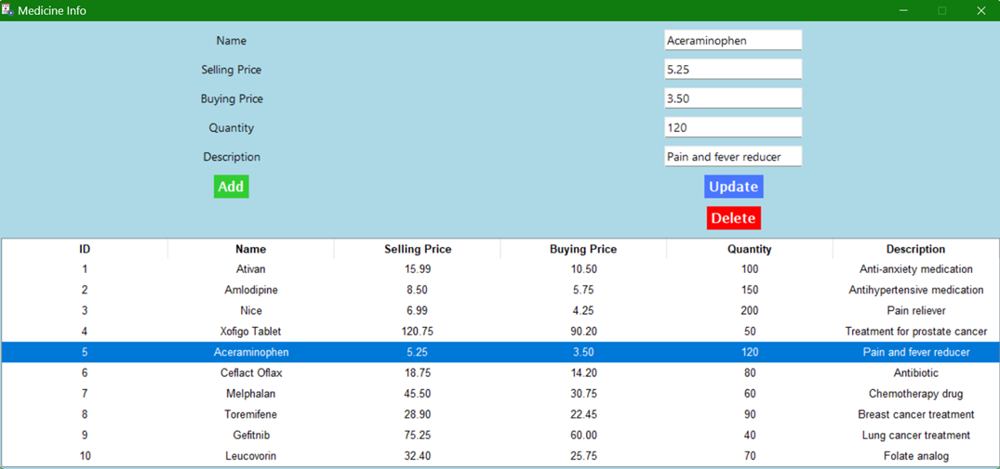

# Hospital_Management_System
Hospital Management System Overview This is a Hospital Management System implemented in Python, with the main functionality encapsulated in the main.py file. This system aims to streamline the administrative and medical processes within a hospital, making it easier for staff to manage patient records, appointments, and other essential tasks.

# Features : 

    1. Patient Management: Add, update, and delete patient records with ease. Keep track of patient details, medical history, and other relevant information.
    
    2. Billing System: Generate and manage bills for services provided, making it simpler to handle financial transactions within the hospital.
    
    3. User Authentication: Secure the system by requiring login credentials for access, ensuring that only authorized personnel can use the application.

# Prerequisites :

    Before running the Hospital Management System, make sure you have the following installed:
    Python (version 3.x)

# How to Run Clone

The repository to your local machine:

    git clone https://github.com/your-username/Hospital_Management_System.git
    
Navigate to the project directory:
    
    cd Hospital_Management_System Install dependencies:
    
    python main.py

Navigate through the various sections of the system to manage patients, billing.

Make use of the intuitive user interface to perform desired actions and efficiently manage hospital-related tasks.

# If you would like to contribute to the Hospital Management System, please follow these steps:

    1. Fork the repository. 
    2. Create a new branch for your feature or bug fix. 
    3. Implement your changes.
    4. Submit a pull request.

# Snapshot :

